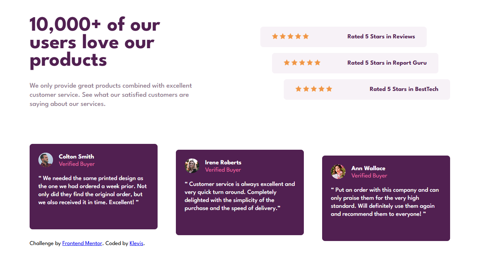

⭐ Social Proof Section

A responsive Social Proof Section built as part of a Frontend Mentor challenge.
The project displays customer ratings and testimonials in a modern UI layout to demonstrate trust and credibility.

🚀 Features

- Customer rating cards
- Testimonial cards with user avatars
- Star rating display
- Responsive layout for mobile and desktop
- Clean modern UI design
- Structured testimonial section

| Technology             | Purpose                 |
| ---------------------- | ----------------------- |
| **HTML5**              | Semantic page structure |
| **CSS3**               | Styling and layout      |
| **Flexbox / CSS Grid** | Layout alignment        |
| **GitHub Pages**       | Deployment              |

📸 Screenshot

